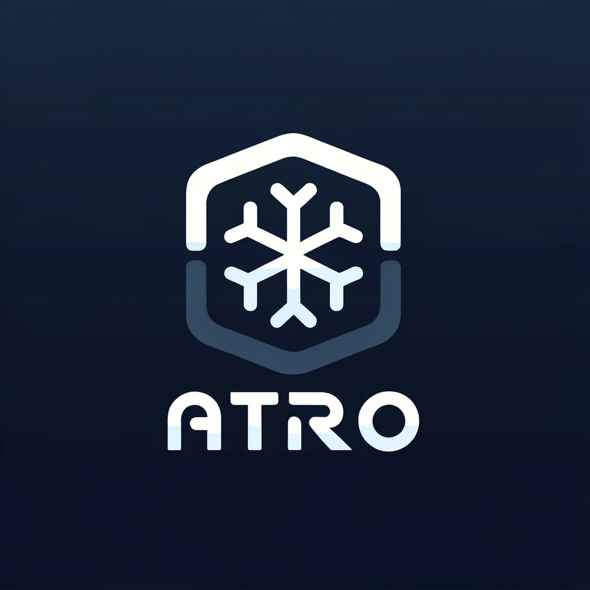

<p align="center">
  
</p>

# Devices

| Hostname | CPU             | RAM          | Details                                                                                                          |
| -------- | --------------- | ------------ | ---------------------------------------------------------------------------------------------------------------- |
| giant    | i9-12900K (x64) | 64 GB (DDR5) | My main home workstation, comes with Nvidia RTX3090.                                                             |
| surface  | i7-8650U (x64)  | 16 GB        | Travel laptop, Surface Book 2, comes with internal and external GPU, I don't use the external Nvidia GPU though. |
| rzr      | i7-6900K (x64)  | 32 GB        | K8s master node with GTX 1080 Ti GPU.                                                                            |
| a21      | i3-10100F (x64) | 32 GB        | K8s master node.                                                                                                 |
| smol     | i5-10210U (x64) | 16 GB        | K8s master node.                                                                                                 |
| opi1     | RK3588S (Arm64) | 16 GB        | Orange Pi 5, k8s worker node.                                                                                    |
| opi2     | RK3588S (Arm64) | 16 GB        | Orange Pi 5, k8s worker node.                                                                                    |
| opi3     | RK3588S (Arm64) | 16 GB        | Orange Pi 5, k8s worker node.                                                                                    |
| opi4     | RK3588S (Arm64) | 16 GB        | Orange Pi 5, k8s worker node.                                                                                    |

# Outline

My home infrastructure is composed of two types of devices, ones which are part of kubernetes cluster and desktop computers. Desktop come with

> [!NOTE]
>
> **System Information:**
>
> - **Window Manager:** Hyprland
> - **Shell:** ZSH
> - **Terminal:** Kitty
> - **Editor:** Neovim (external for now)

Kubernetes nodes are a cut down version that do not come with a WM of any kind. I do however have a pikvm with ezCoo 4x1 HDMI switch that allows me to access the 3 master nodes in case something was to go wrong with them, look for details [here](https://docs.pikvm.org/multiport/), this is in case I can't connect to the machines via SSH directly.

I am able to deploy from both giant and surface machines to all machines, I do this with sudo because only my root user has ssh access to other root users, this isn't ideal still but is best I could come up with. To do such deployment to all orange pi's I would do

```bash
sudo colmena apply --on "opi-*"
```

# Work to be done

- Orange Pi Zero 2W setup is not working it needs fixing.
- My neovim setup should be ingested.
