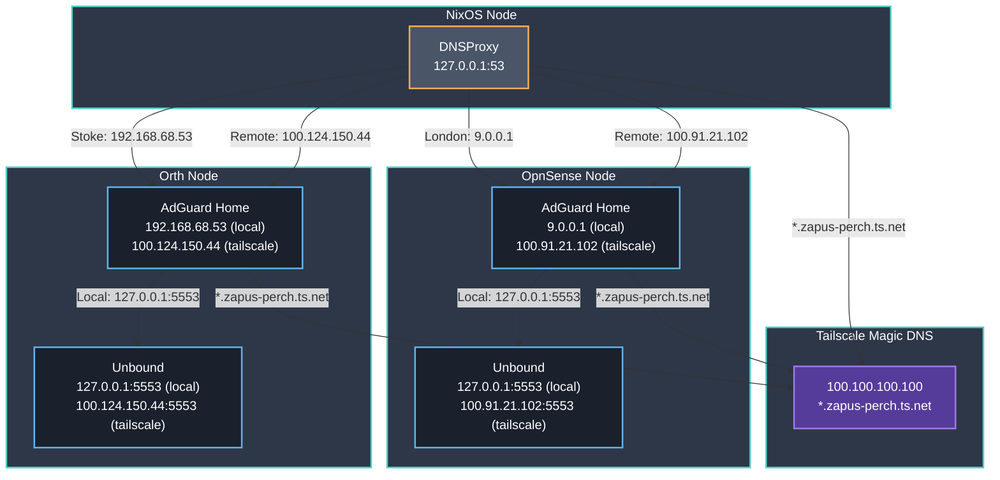
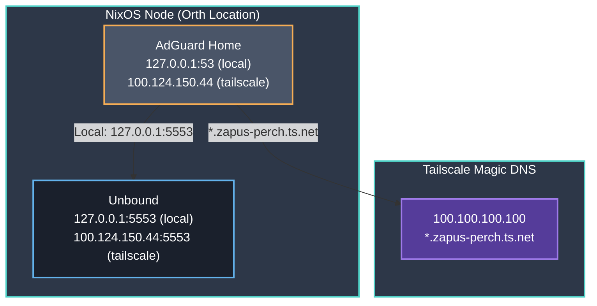
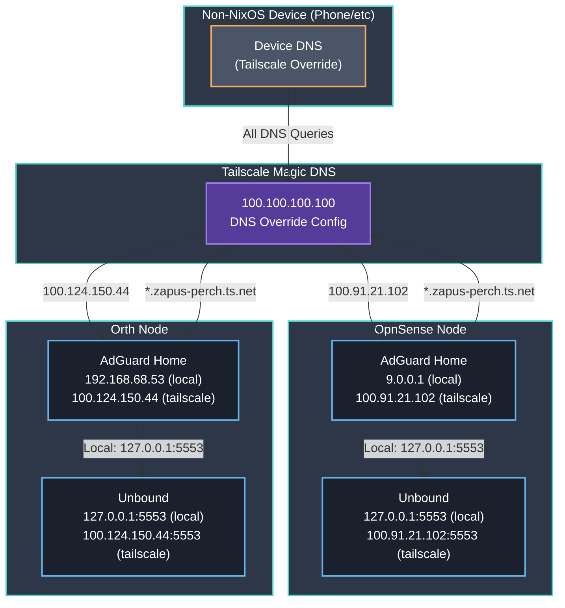

# DNS

## Node DNS Setups

The setup is divided into three types

- NixOS based node running DNSProxy (no AdGuard Home).
- NixOS based node running AdGuard Home and Unbound (not DNSProxy).
- Non-NixOS device like a phone.

### NixOS with DNSProxy

Divided into 3 cases based on location/usage. A node is exclusively one of the following:

- london
- stoke
- remote

Based on that it uses different adguard home's to connect to, possibly different ways of connecting to them (local vs tailscale).

> [!NOTE]
> Although adguard home will resolve `*.zapus-perch.ts.net` to `100.100.100.100`, the DNSProxy will
> actually not forward those queries to adguard home anyway but it will itself resolve `*.zapus-perch.ts.net`
> directly to `100.100.100.100`. The reason AdGuard Home has the resolving is for the case below.

### NixOS with AdGuard Home and Unbound

In this case showing how Orth is configured, but in principle adding any other node, would trivially generalise.

### Non-NixOS Device

> [!NOTE]
> The fact that AdGuard Home would resolve `*.zapus-perch.ts.net` to `100.100.100.100` is only in the picture for completeness.
> It would never actually be used as we go through `100.100.100.100` in the first place and it would
> resolve the `*.zapus-perch.ts.net` directly there and not pass through to AdGuard Home, there is no cyclic dependency (contrary to what the diagram might suggest).

## DNS serving configurations

### Orth

- Declared mostly in NixOS, allowing for edits in UI (discouraged) but overwritten by NixOS.
- Unbound is declared entirely in NixOS.

### OpnSense

- Not declared, installed manually via the OpnSense UI with external library that had to be added also.

### Tailscale

- Manually set DNS global nameservers to be orth and opnsense Tailscale IPs, so that all Tailscale clients use them for DNS resolution.
